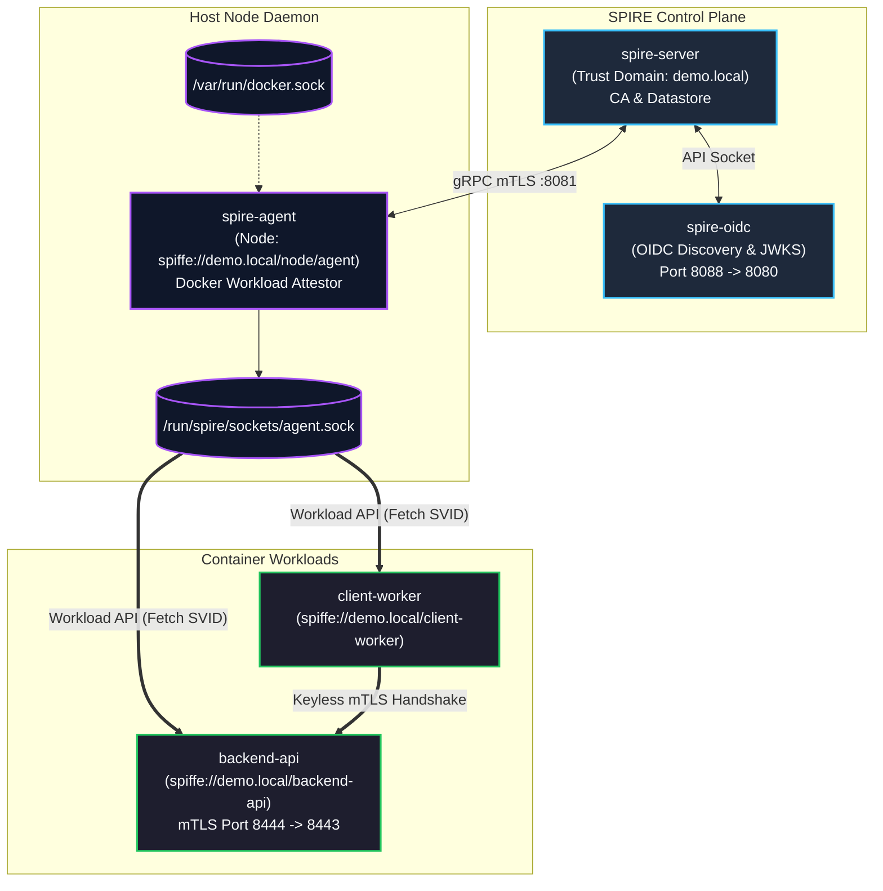
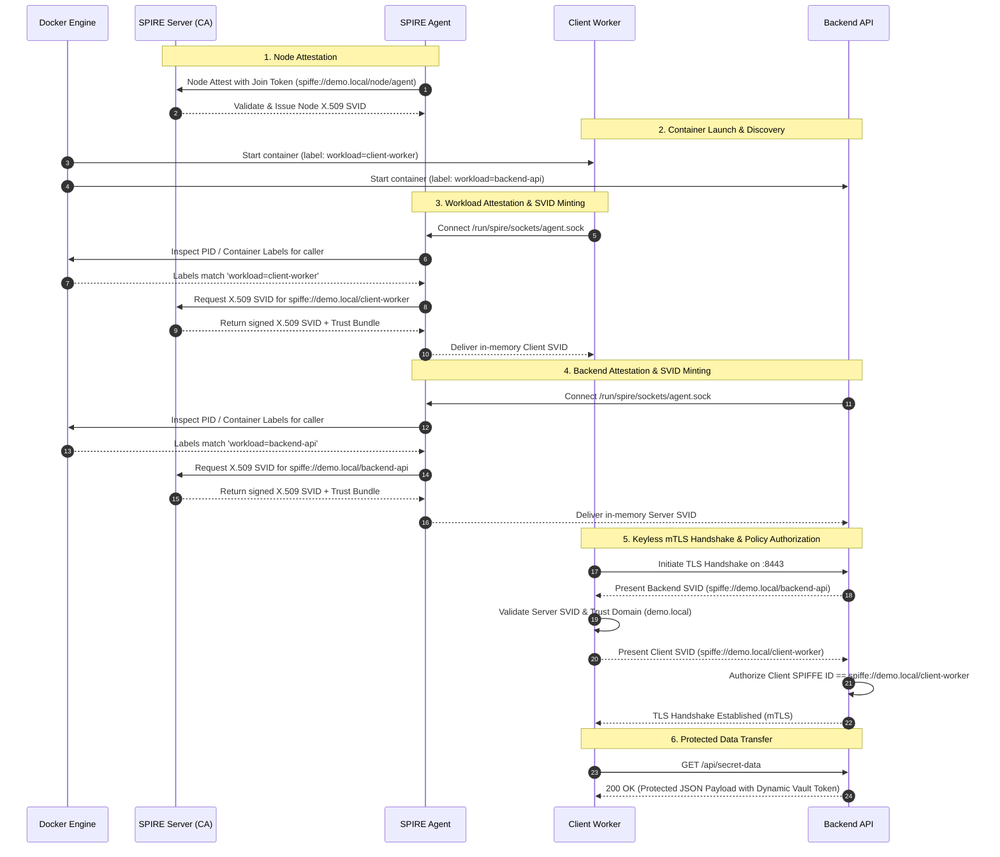

# 🔑 ZeroKey — SPIRE / SPIFFE Keyless Workload Identity Platform

[](https://github.com/cchostak/zerokey/actions/workflows/ci.yml)
[](https://github.com/cchostak/zerokey/actions/workflows/security.yml)
[](https://golang.org)
[](LICENSE)
[](GLOSSARY.md)
[](catalog-info.yaml)

An enterprise, production-grade platform demonstrating **Keyless Workload Authentication** using **SPIRE** (the SPIFFE Runtime Environment) and **SPIFFE** (Secure Production Identity Framework for Everyone) CNCF standards.

---

## 🌟 Executive Overview & Motivation

Static API keys, long-lived certificates on disk, and hardcoded tokens are prone to credential sprawl, rotation drift, and unauthorized replay. 

**ZeroKey** eliminates static credentials by establishing **cryptographically verifiable workload identities (SPIFFE IDs)** and short-lived **X.509 SVIDs (SPIFFE Verifiable Identity Documents)** dynamically issued and rotated through the **SPIFFE Workload API** over a local Unix Domain Socket.

### Core Architectural Pillars
- **Zero Static Credentials:** Private keys and certificates exist only in memory, never persisted on disk or baked into container image layers.
- **Kernel-Level Workload Attestation:** The SPIRE Agent verifies calling processes via `/var/run/docker.sock`, cgroups, and container labels before minting identities.
- **Dynamic In-Memory Rotation:** X.509 SVIDs are continuously refreshed in background streams by `go-spiffe/v2` without application restarts.
- **Default-Deny Mutual TLS (mTLS):** Every transport connection validates cryptographic identity, trust domain boundaries, and explicit authorized SPIFFE IDs.
- **Federated OIDC / JWKS Discovery:** Serves standard OpenID Connect discovery documents and JSON Web Key Sets (JWKS) for multi-cloud identity federation.

---

## 📖 Glossary — Plain-English Guide to the Acronyms

> **New here?** This section explains every piece of jargon used in this project in plain language.
> A full standalone reference is also available in [`GLOSSARY.md`](GLOSSARY.md).

| Term | What it actually is |
| :--- | :--- |
| **SPIFFE** | *Secure Production Identity Framework for Everyone.* A CNCF open standard that defines how software services prove *who they are* to each other — the same way a passport proves who a person is, but for code running in containers or VMs. |
| **SPIRE** | *SPIFFE Runtime Environment.* The software that *implements* the SPIFFE standard. Think of SPIRE as the passport office: it decides which workloads qualify for an identity, signs their certificates, and revokes them when they expire. |
| **SPIFFE ID** | A globally unique name for a workload, written as a URI: `spiffe://your-company.com/service-name`. It plays the role of a username, but it is cryptographically backed — you cannot forge it without the private key. |
| **SVID** | *SPIFFE Verifiable Identity Document.* The actual credential (an X.509 certificate or a JWT) that a workload presents to prove its SPIFFE ID. SVIDs are short-lived (minutes to hours) and exist **only in memory** — they are never written to disk. |
| **X.509** | The technical standard behind TLS certificates — the same kind used by `https://` websites. An X.509 SVID is essentially a TLS certificate that carries the workload's SPIFFE ID in its Subject Alternative Name field. |
| **mTLS** | *Mutual TLS.* Normal HTTPS only proves that the *server* is who it claims to be (e.g. your bank's website). Mutual TLS makes *both sides* prove their identity before data flows. Neither client nor server can impersonate the other. |
| **Keyless / Zero-Static-Credentials** | No passwords, API keys, or long-lived secrets are stored in config files, environment variables, or container images. Credentials are minted on demand, live only in RAM, and expire automatically. |
| **Workload** | In this context, any piece of software running inside a container — a microservice, a job, a sidecar. The word is used instead of "app" to emphasise that the *running process* (not just the image) gets an identity. |
| **Workload Attestation** | The process of SPIRE *verifying* that a workload is what it claims to be before issuing an SVID. ZeroKey uses Docker label inspection: the agent reads `/var/run/docker.sock` to confirm the container was started with the correct label (`workload=backend-api`, etc.). |
| **Node Agent** | The `spire-agent` daemon that runs on each host machine. Workloads talk to it over a local Unix socket (a file-like pipe on the host). It acts as a local proxy to the SPIRE Server. |
| **Trust Domain** | A namespace for identities, analogous to a company's domain name. In this project it is `demo.local`. A workload in `demo.local` does not automatically trust workloads in `other-company.com`. |
| **Trust Bundle** | A collection of root Certificate Authority (CA) certificates. Workloads use the trust bundle to verify that an SVID was actually signed by their SPIRE Server and not by a random third party. |
| **CA / Certificate Authority** | The part of SPIRE Server that *signs* certificates. It acts like a notary: it stamps the SVID with its signature so that anyone who trusts the CA can also trust the SVID. |
| **OIDC / OpenID Connect** | A standard identity layer on top of OAuth 2.0. SPIRE can publish an OIDC discovery endpoint so that cloud services (AWS IAM, GCP Workload Identity, etc.) can verify SPIRE-issued JWTs without needing to talk to SPIRE directly. |
| **JWKS** | *JSON Web Key Set.* A public URL that lists the cryptographic public keys a JWKS issuer (here: SPIRE) uses to sign JWTs. External parties fetch the JWKS once to be able to verify tokens offline. |
| **JWT** | *JSON Web Token.* A compact, URL-safe token format. SPIRE can issue JWT-SVIDs (instead of X.509 SVIDs) for workloads that talk over HTTP/REST rather than raw TLS. |
| **Unix Domain Socket** | A file on disk (`*.sock`) that two local processes use as a pipe to talk to each other — faster and more secure than a network port because it is not reachable from outside the host. The Workload API lives at `/run/spire/sockets/agent.sock`. |
| **TTL** | *Time To Live.* The remaining lifetime of a credential before it expires. A short TTL (e.g. 1 hour) means that even if an SVID leaks, it becomes useless very quickly. SPIRE rotates SVIDs automatically before expiry. |
| **CNCF** | *Cloud Native Computing Foundation.* The open-source foundation (part of the Linux Foundation) that hosts projects like Kubernetes, Prometheus, and SPIFFE/SPIRE. |
| **OTel / OpenTelemetry** | A CNCF standard for collecting logs, metrics, and traces from services. ZeroKey pipes telemetry through an OpenTelemetry Collector before it reaches Prometheus and Grafana. |
| **Prometheus** | An open-source metrics database. It scrapes numeric measurements (e.g. "how many mTLS handshakes succeeded per second?") from services and stores them for querying. |
| **Grafana** | A dashboarding tool that queries Prometheus and Loki and draws charts. Open [http://localhost:3001](http://localhost:3001) to see ZeroKey's live dashboards. |
| **Loki** | A log aggregation system from Grafana Labs. Think of it as a searchable inbox for all container log lines, queryable from Grafana using the LogQL query language. |
| **Promtail** | The agent that tails Docker container logs and ships them to Loki. It runs as a container itself and reads from `/var/run/docker.sock`. |

---

## 🏛️ System Architecture

### 1. Component Topology



### 2. End-to-End Keyless mTLS Authentication Sequence



---

## 📦 Services in This Platform

| Service | Container Image / Path | Port Mapping | Description |
| :--- | :--- | :--- | :--- |
| `dashboard-ui` | Built from `./dashboard/frontend` (Next.js 15) | `3000:3000` | Web Management Console & Real-Time Identity Explorer. |
| `dashboard-api` | Built from `./dashboard/backend` (FastAPI) | `8000:8000` | Control Plane API, SPIRE socket bridge, and WebSocket telemetry stream. |
| `spire-server` | `ghcr.io/spiffe/spire-server:1.9.0` | `8081:8081` | Core SPIFFE Certificate Authority and SQLite registration datastore. |
| `spire-oidc` | `ghcr.io/spiffe/oidc-discovery-provider:1.9.0` | `8088:8080` | OIDC discovery provider serving JWKS for external federated verification. |
| `spire-agent` | `ghcr.io/spiffe/spire-agent:1.9.0` | - | Host node agent verifying container identity via `/var/run/docker.sock`. |
| `backend-api` | Built from `./app/Dockerfile.server` | `8444:8443` | Go mTLS HTTPS server accepting only authorized client SPIFFE IDs. |
| `client-worker` | Built from `./app/Dockerfile.client` | - | Go mTLS client fetching SVID and invoking protected backend endpoints. |
| `grafana` *(profile: obs)* | `grafana/grafana:10.3.3` | `3001:3000` | Pre-provisioned dashboards for SVID lifecycles and mTLS latency. |
| `loki` *(profile: obs)* | `grafana/loki:2.9.4` | `3100:3100` | Unified log aggregation for SPIRE and container access logs. |
| `otel-collector` *(profile: obs)* | `otel/opentelemetry-collector-contrib` | `4317, 4318` | OpenTelemetry collector for traces and metrics. |

---

## 🚀 Quickstart (< 5 Minutes)

### 1. Prerequisites Check
Validate that your local environment has the required CLI tools, Docker daemon, and available ports:
```bash
make doctor
```

### 2. Launch Containers
Initialize configuration and launch the container stack in detached mode:
```bash
make up
```

### 3. Bootstrap Node & Workload Identities
Registers the node agent with a join token and establishes SPIRE datastore entries matched by Docker labels:
```bash
make bootstrap
```

### 4. Execute Keyless mTLS Test Flow
Execute an end-to-end keyless transaction from `client-worker` to `backend-api`:
```bash
make test-flow
```

### 5. Access the Web Management Console & Observability
Open the interactive console in your browser:
- 🌐 **Web Console:** [http://localhost:3000](http://localhost:3000)
- ⚙️ **Control Plane API:** [http://localhost:8000/docs](http://localhost:8000/docs)
- 📈 **Observability (Optional):** Run `make obs-up` and open [http://localhost:3001](http://localhost:3001) (Grafana)

#### Example Output:
```text
======================================================================
  🔒 Executing Keyless mTLS Authentication Test: client -> backend-api 
======================================================================
2026/08/29 11:05:00 ==================================================
2026/08/29 11:05:00   🔑 Starting SPIFFE-Enabled Client Worker        
2026/08/29 11:05:00 ==================================================
2026/08/29 11:05:00 Connecting to SPIFFE Workload API at unix:///run/spire/sockets/agent.sock...
2026/08/29 11:05:00 ✅ Client SVID acquired successfully!
2026/08/29 11:05:00    ├─ Client SPIFFE ID: spiffe://demo.local/client-worker
2026/08/29 11:05:00    ├─ Trust Domain:     demo.local
2026/08/29 11:05:00    └─ Cert Expires:     2026-08-29T12:05:00Z
2026/08/29 11:05:00 📤 Dispatching keyless mTLS request to https://backend-api:8443/api/secret-data...
2026/08/29 11:05:00 🎉 [RESPONSE 200 OK] (18.2ms) Received payload:
   ┌────────────────────────────────────────────────────────
   │ {
   │   "authenticated_client_spiffe_id": "spiffe://demo.local/client-worker",
   │   "message": "Keyless Authentication Successful via SPIRE/SPIFFE mTLS!",
   │   "protected_payload": {
   │     "access_granted_at": "2026-08-29T11:05:00Z",
   │     "environment": "production-demo",
   │     "identity_provider": "SPIRE Node & Workload Attestor",
   │     "secret_vault_token": "dynamic-keyless-token-xyz-7890"
   │   },
   │   "server_spiffe_id": "spiffe://demo.local/backend-api",
   │   "status": "success",
   │   "timestamp": "2026-08-29T11:05:00Z"
   │ }
   └────────────────────────────────────────────────────────
✅ Single-shot test completed successfully!
```

---

## ⚙️ Configuration Reference

### Environment Variables (`.env`)

| Variable | Default Value | Description |
| :--- | :--- | :--- |
| `JOIN_TOKEN` | `demo-lab-join-token` | One-time join token used for node agent attestation. |
| `TRUST_DOMAIN` | `demo.local` | Root trust domain prefix for all SPIFFE IDs. |
| `SPIFFE_ENDPOINT_SOCKET` | `unix:///run/spire/sockets/agent.sock` | Unix domain socket address for the SPIFFE Workload API. |
| `OIDC_HOST_PORT` | `8088` | Local host port mapped to SPIRE OIDC Discovery provider. |
| `BACKEND_HOST_PORT` | `8444` | Local host port mapped to the backend API HTTPS service. |
| `ALLOWED_CLIENT_SPIFFE_ID` | `spiffe://demo.local/client-worker` | SPIFFE ID authorized by `backend-api` to access protected routes. |
| `EXPECTED_SERVER_SPIFFE_ID` | `spiffe://demo.local/backend-api` | Server identity verified by `client-worker` during TLS handshake. |
| `RUN_ONCE` | `false` | When `true`, client executes one request and exits with status code. |

---

## 🛠️ CLI Operations & Makefile Reference

| Target | Description |
| :--- | :--- |
| `make help` | Display all available Makefile targets with formatted descriptions. |
| `make init` | Initialize directory structure, template `.env`, and script permissions. |
| `make up` | Build workload images and start all containers in detached mode. |
| `make bootstrap` | Attest the node agent and register workload identities in SPIRE. |
| `make test-flow` | Execute a single-shot keyless mTLS transaction with payload inspection. |
| `make check` | Run static linters (Go vet/fmt check, Docker compose validation, ShellCheck, YAML linter). |
| `make fmt` | Auto-format Go code and repository files. |
| `make test` | Execute Go unit test suite with race detector and coverage report. |
| `make test-smoke` | Run end-to-end integration smoke test suite against running containers. |
| `make scan` | Run local secret leak detection (Gitleaks / pattern auditing). |
| `make doctor` | Run diagnostic checks verifying CLI tools, Docker daemon, and free ports. |
| `make status` | Display registered SPIRE agents, entries, and container runtime states. |
| `make oidc-keys` | Fetch and inspect OpenID configuration and published JWKS keys. |
| `make logs` | Stream logs across all running containers in real-time. |
| `make down` | Stop all stack containers. |
| `make clean` | Stop containers, purge volumes, delete runtime datastores and test artifacts. |
| `make reset` | Full clean re-initialization (`clean` + `up` + `bootstrap` + `test-flow`). |

---

## 🩺 Diagnostic & Troubleshooting Guide

### 1. `Workload API not available yet / dial unix ... connect: no such file or directory`
- **Cause:** The client/backend application started before the SPIRE Agent created the Unix Domain Socket.
- **Resolution:** The applications feature built-in exponential retry loops. If the socket does not appear after 30 seconds, verify that `spire-agent` is running (`docker compose ps`) and inspect agent logs (`docker compose logs spire-agent`).

### 2. `Agent is not attested / token expired`
- **Cause:** Join tokens are single-use. If containers are recreated without bootstrapping, attestation fails.
- **Resolution:** Run `make bootstrap` or `make reset` to mint a fresh join token and re-attest the node.

### 3. `TLS Handshake Error: certificate required / bad certificate`
- **Cause:** A client connected to `backend-api:8443` without presenting an X.509 certificate issued by the `demo.local` SPIRE CA, or the client presented an unauthorized SPIFFE ID.
- **Resolution:** This is the expected default-deny security behavior. Only containers with the `spiffe://demo.local/client-worker` identity can complete the handshake.

### 4. `OIDC endpoint unreachable on port 8088`
- **Cause:** Port conflict with an existing local service or `spire-oidc` container failed to start.
- **Resolution:** Run `make doctor` to verify port availability, or adjust `OIDC_HOST_PORT` in `.env`.

---

## 📜 Architecture Decision Records (ADRs)

Key architectural decisions are documented under [`docs/adr/`](docs/adr/):
- [ADR 0001: Record Architecture Decisions](docs/adr/0001-record-architecture-decisions.md)
- [ADR 0002: Core Architecture, SPIRE/SPIFFE Keyless Workload Identity, and mTLS Security Boundaries](docs/adr/0002-core-architecture-and-stack.md)

## 📖 Additional Documentation
- [**GLOSSARY.md**](GLOSSARY.md) — Plain-English guide to every acronym and concept (SPIFFE, SPIRE, SVID, mTLS, OIDC, JWKS, TTL, and more).

---

## 📄 License

Licensed under the [Apache License, Version 2.0](LICENSE).
